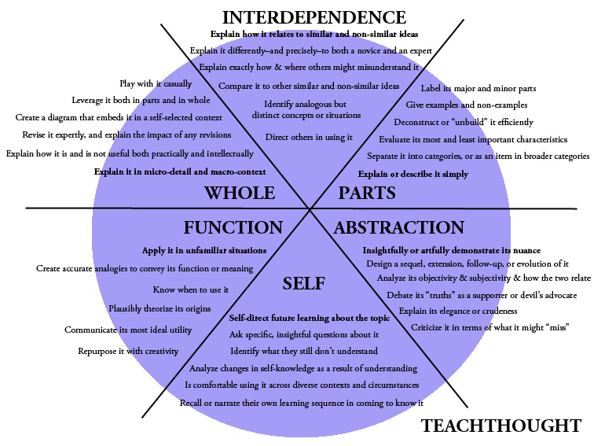

# Pedagogy and curriculum development

The key to success in this and every training program is **humility**. The container that is already full can hold no more. First, empty out the self. Then you will have room for new ideas, knowledge, and skills.

Similarly, an open mind is essential. Strive to understand rather than to judge. When presented with new facts with which you have trouble agreeing, try to imagine a world in which they would be true facts.

## The Munat Method

1. **Skills over knowledge** (S/K)
    - Knowledge can be had instantly on Google.
    - Skills require lots of practice and a good mentor.
2. **Real-world tools, methods, work** (RW)
    - You have to do the work sooner or later
    - Build a portfolio while learning
3. **Top-down (outside-in, contextualized) learning** (TD)
    - Beginners need context first
    - Reduce cognitive load
    - Synthesis over analysis
    - Deductive over inductive
4. **Front-to-back learning** (F2B)
    - Learn the most up-to-date information *first*
    - Work backwards only as necessary and only as far as necessary
5. **Single, shortest-path learning** (SSP)
    - Choose one excellent path and follow it
    - Save consideration of alternatives until the student has achieved mastery of one path
    - Reduce confusion and cognitive load
6. **Just-in-time learning** (JITL)
    - Learn only what you need to know, exactly when you need to know it, apply it immediately
    - Don't learn-to-warehouse: just-in-*case* learning (JICL)
    - Reduce cognitive load
    - Maximize efficiency
7. **Full immersion** (FI)
    - Use everything available to maximize learning
        - Diet
        - Exercise
        - Environment
        - Pedagogy
        - Sleep
        - Socialization
        - Gamification
        - Etc.
    - Dynamic, diverse, interesting, fun
8. **Made-to-measure** (M2M)
    - Learning is never one-size-fits-all
    - Small groups, individual attention
    - Self-paced and self-directed
    - *Manifest the methods*: make the pedagogy visible
9. **Student-centered** (SC)
    - Student is in charge of his or her own learning
    - The instructor follows the student's lead
10. **Adaptive learning** (AL)
    - If it's not working, change it
    - Experimental (student experiments on self with instructor mentoring)
    - Students choose path from a curated set of options, or suggest new ideas
11. **Progressive autonomy** (PA)
    - Initially, students should set aside their egos and do what they're asked to do with an open mind
    - As they acquire skills and knowledge, they gain progressively greater autonomy
    - By the finish of the immersive course, they should need only minimal and occasional guidance
12. **Teachers over experts** (T/E)
    - Teaching is a job for teachers
    - A domain expert or experts should be available to double check facts and procedures, but *must not* determine curricula or pedagogy

## Learning theory

You should gain some brief familiarity with these concepts to know what's out there. Then practice the key ones until they are comfortable for you.

- [Types of assessment](http://www.monroeisd.us/departments/curriculum/instructionalservices/assessment/typesofassessment/)
    - [Formative](https://en.wikipedia.org/wiki/Formative_assessment)
    - [Interim](http://edglossary.org/interim-assessment/)
    - [Summative](http://edglossary.org/summative-assessment/)
- Terminology & philosophy
    - [Action research](http://edglossary.org/action-research/)
    - [Active learning](http://www.otan.us/browse/index.cfm?fuseaction=doc&catid=23610&ref=595)
    - [Apprenticeship](https://en.wikipedia.org/wiki/Apprenticeship)
    - [Asynchronous learning](http://edglossary.org/asynchronous-learning/)
    - [Authentic learning](http://edglossary.org/authentic-learning/)
    - [Blended learning](http://edglossary.org/blended-learning/)
    - [Collaborative learning](https://en.wikipedia.org/wiki/Collaborative_learning)
    - [Community-based learning](http://edglossary.org/community-based-learning/)
    - <a href="https://en.wikipedia.org/wiki/Constructivism_(philosophy_of_education)">Constructivism</a> ([Connectivism](http://www.downes.ca/post/61941))
    - [Continuous improvement](http://edglossary.org/continuous-improvement/)
    - [Cooperative learning](https://en.wikipedia.org/wiki/Cooperative_learning)
    - [Curricular integration](http://study.com/academy/lesson/integrated-curriculum-definition-benefits-examples.html)
    - [Differentiatiation](http://edglossary.org/differentiation/)
    - [Distance learning](https://en.wikipedia.org/wiki/Distance_education)
    - [Evidence-based learning](http://edglossary.org/evidence-based/)
    - [Experiential learning](https://en.wikipedia.org/wiki/Experiential_learning)
    - [Flipped classroom](https://en.wikipedia.org/wiki/Flipped_classroom) ([7 Things to Know](https://net.educause.edu/ir/library/pdf/eli7081.pdf))
    - [Guided practice](http://www.otan.us/browse/index.cfm?fuseaction=doc&catid=23642&ref=624)
    - [Hidden curriculum](http://edglossary.org/hidden-curriculum/)
    - [Immersion](http://www.otan.us/browse/index.cfm?fuseaction=doc&catid=23202&ref=215)
    - [Knowledge transfer](https://en.wikipedia.org/wiki/Knowledge_transfer)
    - [Learning lab](http://edglossary.org/learning-lab/)
    - [Learning pathway](http://edglossary.org/learning-pathway/)
    - [Multiple intelligences](https://en.wikipedia.org/wiki/Theory_of_multiple_intelligences) ([Also](http://www.tecweb.org/styles/gardner.html))
    - [Outcomes-based education](https://en.wikipedia.org/wiki/Outcome-based_education)
    - [Personalized learning](http://edglossary.org/personalized-learning/) ([Personal learning](http://www.downes.ca/post/65065))
    - [Professional development](http://edglossary.org/professional-development/)
    - [Professional learning community](http://edglossary.org/professional-learning-community/)
    - [Project-based learning](http://edglossary.org/project-based-learning/)
    - [Question generation](http://www.otan.us/browse/index.cfm?fuseaction=doc&catid=23271&ref=269) ([Strategies](http://www.adlit.org/strategies/22093/))
    - [Reciprocal teaching](https://en.wikipedia.org/wiki/Reciprocal_teaching)
    - [Scaffolding](http://edglossary.org/scaffolding/)
    - [Service learning](https://en.wikipedia.org/wiki/Service-learning)
    - [Synchronous learning](http://edglossary.org/synchronous-learning/)
    - [Universal Design for Learning](https://en.wikipedia.org/wiki/Universal_Design_for_Learning) (UDL)
    - [Voice](http://edglossary.org/voice/)
    - [Whole language approach](https://en.wikipedia.org/wiki/Whole_language)
    - [Workplace skills](http://www.otan.us/browse/index.cfm?fuseaction=doc&catid=33578&ref=793)
    - [Zero conditional](http://www.otan.us/browse/index.cfm?fuseaction=doc&catid=23576&ref=562)

## Bloom's taxonomy

Bloom's taxonomy is widely used, but somewhat controversial. Several researchers have suggested updates or improvements. YMMV.

The original Bloom's:

[Alternatives to Bloom](http://www.teachthought.com/learning/5-alternatives-to-blooms-taxonomy/)

An interesting alternative to Bloom:

## Fallacies

An understanding of logical and rhetorical fallacies will prove extremely useful in developing critical thinking.

- [Rhetorical fallacies](http://www.informationisbeautiful.net/visualizations/rhetological-fallacies/) (I'd like to develop a card game based on these.)
- [Formal fallacy](https://en.wikipedia.org/wiki/Formal_fallacy)
- [Informal fallacy](https://en.wikipedia.org/wiki/Informal_fallacy)

