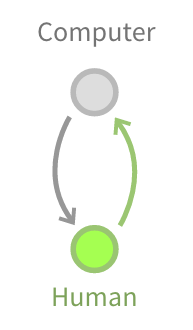

# Reactive programming

## React/Redux

### [React](https://facebook.github.io/react/)

A library for creating user interfaces. The V in MVC.

- [Book](https://www.dropbox.com/s/ctwi303vrsfuu3z/survivejs-react.pdf?dl=0)
- [JSX](https://facebook.github.io/jsx/)
- Virtual DOM
- Renderers
    - ReactDOM
    - React Native
- React Elements
    - Type: string
    - Type: ReactClass
    - Props
    - PropTypes
- Functions (presentational) vs. classes (state)
    - Component
- State
- Context
- Lifecycle methods (hooks)
    - Mounting
        - componentWillMount
        - render
        - componentDidMount
    - Mounted
        - Props change
            - componentWillReceiveProps (props change)
        - State change
            - componentShouldUpdate
            - componentWillUpdate
            - render
            - componentDidUpdate
    - Unmounting
        - componentWillUnmount
- Refs
- Custom properties and methods
    - displayName
    - getInitialState
    - getDefaultProps
    - render
    - statics
- Controlled and uncontrolled components
- Server-side rendering (universal)
- [Awesome React](https://github.com/enaqx/awesome-react)

### [Redux](http://redux.js.org/)

A predictable state container for JavaScript apps. Implements a version of Flux:

- Principles
    - Single source of truth
    - Immutable (read only)
    - Changes made with pure functions (reactive)
- Actions
    - Asynchronous actions
    - Action creators
        - bindActionCreators
    - Memoization
- Reducers
- Store
    - combineReducers
    - createStore
- Data flow
- Components
    - Presentational
    - Container
- API
    - mapStateToProps
    - mapDispatchToProps
    - connect
    - compose
- Middleware
    -applyMiddleware
- Server-side rendering (universal)
- [Awesome Redux](https://github.com/xgrommx/awesome-redux)

## Testing

- [Mocha](http://mochajs.org/)
- [Enzyme](http://airbnb.io/enzyme/)
- [Chai](http://chaijs.com/)
- [Chai-enzyme](https://github.com/producthunt/chai-enzyme)
- [Sinon](http://sinonjs.org/docs/)
- [JSDOM](https://github.com/tmpvar/jsdom)
- [Enzyme with Mocha](http://airbnb.io/enzyme/docs/guides/mocha.html)

## Functional Reactive Programming (FRP)

### [Cycle.js](http://cycle.js.org/)

- Streams
- Model-View-Intent (MVI)
- Components
- Drivers
    - DOM Driver

### [RxJS](https://github.com/Reactive-Extensions/RxJS)

- Observables and observable sequences
- [RxMarbles](http://rxmarbles.com/)
